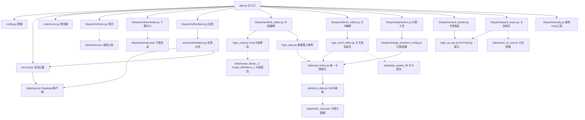

# PVZH Mod 工具箱 (PVZ Heroes Mod Tools)

**最后一次更新时间： 2026-7-12**

这是一个基于 **Flask + UnityPy + Supabase** 开发的《植物大战僵尸：英雄》(Plants vs. Zombies Heroes, PVZH) 在线 Mod 辅助工具箱。项目采用 Flask 蓝图 (Blueprint) 模块化架构，提供了卡组编辑、关卡编辑、Unity AB 包解包回填、幻影卡牌工坊、卡包购买、卡牌发送、下载中心（分区 + 作品包）以及用户反馈等功能。

该项目已针对 Render 免费套餐进行了优化部署配置（例如加入串行处理锁、内存清理与自唤醒逻辑）。

---

## 🗺️ 项目整体架构与模块关系

项目主要由 **路由与控制层**、**业务逻辑层**、**数据资产层** 和 **安全与基础设施** 四大部分组成。以下是项目各模块之间的依赖与数据流向关系：



---

## 📂 目录结构与核心文件解析

```
MyProject/
├── app.py                      # 应用主入口，注册蓝图，配置 Flask-APScheduler 定时自唤醒任务
├── config.py                   # 全局配置类，加载环境变量，设置最大文件上传限制 (150MB)
├── database.py                 # Supabase 客户端懒加载封装，避免启动时强依赖
├── security.py                 # 安全拦截拦截器，提供黑名单 IP 封禁、提交接口的“影子封禁”、安全日志写入
├── extensions.py               # 限流扩展，使用 Flask-Limiter 对接口请求频率进行硬限制
├── logic_data.py               # 卡组和卡牌数据的内存管理单例 (DataManager)
├── logic_ea_api.py             # 封装了与 PopCap/EA 服务器交互的 commitSoftPurchase 接口
├── logic_level_editor.py       # 关卡编辑业务逻辑，使用 UnityPy 解析和打包 data_assets_36 底包
├── logic_unity.py              # 卡组打包业务逻辑，使用 UnityPy 修改底包中卡牌数量并重新生成 zip
├── blueprints/                 # 路由及蓝图实现目录
│   ├── home.py                 # 首页及主导航路由，展示 news.json 中的公告和更新日志
│   ├── downloads.py            # 下载中心：分区目录、single/bundle 与子文件下载
│   ├── feedback.py             # 意见反馈路由（薄层：HTTP 解析 / 限流 / 统一 JSON 响应）
│   ├── deck_editor.py          # 卡组编辑器接口，支持前端初始化载入和自定义修改后的一键打包下载
│   ├── level_editor.py         # 关卡编辑器接口，支持读取 AB 关卡配置列表、提取 JSON 以及回填打包
│   ├── phantom.py              # 幻影卡牌工坊主页及 API
│   ├── logic_phantom_config.py # 幻影工坊的配置加载，从 data/index_new.json 中注入卡牌数据
│   ├── card_sender.py          # 卡牌发送 API，通过模拟 EA 协议直接向绑定账户注入全卡牌
│   ├── pack_buyer.py           # 自定义卡包购买 API，支持在网页端购买指定的卡包 SKU (读取 name_id_cost.txt)
│   └── unity.py                # 通用 Unity 包管理工具，支持在线对 Unity AB 包进行深入解析、解包和补丁回填
├── services/                   # 业务服务层（与蓝图解耦的可复用逻辑）
│   └── feedback.py             # 反馈校验、payload 组装、写入 Supabase feedbacks 表
├── sql/                        # 数据库 schema / 运维脚本
│   └── feedbacks.sql           # Supabase feedbacks 表重建脚本（含 RLS 与 GRANT）
├── data/                       # 核心静态数据与 Unity 底包目录
│   ├── index_new.json          # 全站卡牌索引 (GUID, UUID, NAME_CN, TEXTURE_NAME, TYPE, FACTION, NAME_EN)
│   ├── data_assets_36          # 官方关卡关配置底包 (Unity AssetBundle)
│   ├── recipe_decks_1          # 官方卡组配置底包 1 (Unity MonoBehaviour)
│   ├── recipe_definitions_1    # 官方卡组配置底包 2 (Unity MonoBehaviour)
│   ├── decks.json              # 关卡编辑器使用的预置卡组库
│   ├── downloads.json          # 下载中心分区目录（sections → items，支持 single / bundle）
│   ├── news.json               # 首页的通知和版本更新公告
│   ├── name_id_cost.txt        # 官方卡包 SKU 及其钻石售价对照表
│   └── 笔记卡组名称.txt         # 英雄卡组与对应内部 ID 映射描述
├── docs/                       # 设计与进度文档
│   ├── downloads-refactor-log.md   # 下载中心重构进度对照
│   └── downloads-bundle-plan.md    # 作品包（Bundle）方案与阶段说明
├── scripts/                    # 运维 / 校验脚本
│   └── validate_downloads.py   # 校验 downloads.json 结构与约定
├── static/                     # 前端静态资源目录 (CSS, JS, 图片, 幻影工坊资源)
├── templates/                  # Jinja2 模板目录
│   ├── base.html               # 页面基类模板，包含顶部导航和全局依赖样式引入
│   ├── index.html              # 首页公告模板
│   ├── deck_editor.html        # 卡组编辑器页面 (Vue3 + Tailwind)
│   ├── level_editor.html       # 关卡编辑器页面 (Vue3 + UI 交互)
│   ├── tab_unity.html          # 通用 Unity 解析与解包调试页面
│   ├── tab_downloads.html      # 下载中心列表（分区 Tab + 卡片）
│   ├── card_sender.html        # 一键送卡交互页面
│   ├── pack_buyer.html         # 在线买卡包交互页面
│   ├── phantom.html            # 幻影工坊制作页面
│   ├── feedback.html           # 意见反馈页面（原生 form + fetch，不依赖 Vue）
│   └── download_detail.html    # 下载详情（single / bundle 文件列表）
├── utils/                      # 通用工具函数目录
│   ├── card_index.py           # 统一读取 index_new.json 的卡牌信息，并转换为对应模块的专用格式
│   ├── json_clean.py           # JSON 字符串防御清洗，去除控制字符及 BOM 头，兼容中文符号
│   └── json_data.py            # 辅助读取项目根目录下 data 内 JSON 文件的快捷函数
├── 开始.bat                     # 本地快速启动脚本
└── requirements.txt            # 项目 Python 依赖声明
```

---

## 🛠️ 核心业务逻辑说明

### 1. Unity 资源回填与打包机制 (`logic_unity.py` / `logic_level_editor.py`)

- **解包**：使用 `UnityPy.load()` 载入 AssetBundle 文件，提取 `MonoBehaviour` 或 `TextAsset` 的 typetree 信息。
- **转换**：将 typetree 字典经过 `utils/json_clean.py` 转换为前端更易读取和展示的 JSON 格式。
- **回填**：当用户修改数据并导出时，系统使用内存底包作为模板，替换更新 `CardGuid`、`NumCopies` 等参数后，调用 `obj.save_typetree()` 保存修改，最后以 `.zip` 压缩包或重构后的 `data_assets_36` 文件提供下载。

### 2. EA API 代理流程 (`logic_ea_api.py`)

- **授权方式**：用户在网页端填写 `EADP-AUTH-TOKEN` 和 `EADP-PERSONA-ID`，系统无缝代理直接发包。
- **发送逻辑**：构建带时间戳的伪造客户端请求头，向 PopCap 远程服务器的 `commitSoftPurchase` 接口发送对应的 `Sku`（例如购买卡包的 SKU 或发送特定全卡牌的 `deckRecipe` 协议包）。

### 3. 全局安全及日志审计 (`security.py`)

- **流量限制**：接入 `Flask-Limiter` 限流策略，防止恶意的 API 扫描或频繁提交攻击。
- **真实访客 IP**：`get_visitor_info()` / `visitor_ip_key()` 统一解析 IP（优先 `CF-Connecting-IP`，其次 `X-Forwarded-For`，最后 `remote_addr`），反馈限流与安全拦截共用同一套 key，避免在 Render 反代后全站共享限流桶。
- **黑名单拦截**：在 `before_request` 钩子中命中黑名单时，敏感接口 403、提交类接口影子封禁、普通页面伪装 404。
- **影子封禁 (Shadow Ban)**：对恶意留言/反馈返回与正常成功一致的契约 `{"ok": true, "message": "提交成功"}`，实际不进入业务写入。
- **记录审计**：高危事件写入 Supabase `security_logs`，可通过 `/security/stats`（Header：`X-Admin-Token`）查看当日抽样。

### 4. 意见反馈模块 (`blueprints/feedback.py` + `services/feedback.py`)

**路由**

| 方法 | 路径 | 说明 |
|------|------|------|
| GET | `/feedback` | 反馈页 |
| POST | `/api/feedback/submit` | 提交反馈（限流：每 IP **3 次/小时**） |

**分层**

- 蓝图：解析 JSON、限流、统一响应；不直接拼业务 payload。
- `services/feedback.py`：类型白名单（`bug` / `feature` / `other`）、内容长度校验（内容 ≤500、联系方式 ≤100）、组装 `ua_info`、写入 `feedbacks` 表。

**统一 API 契约**

```json
// 成功 200
{ "ok": true, "message": "提交成功" }

// 校验失败 400
{ "ok": false, "error": "...", "code": "VALIDATION_ERROR" }

// 写入失败 500
{ "ok": false, "error": "服务器开小差了，请稍后再试", "code": "STORAGE_ERROR" }

// 限流 429（extensions 全局 handler，含 error 字段）
{ "ok": false, "error": "操作太频繁啦！...", "code": "RATE_LIMITED", ... }
```

**前端**：`templates/feedback.html` 使用原生 HTML form + `fetch`，不依赖 Vue CDN；按 `ok` / `error` / `message` 展示结果。

**Supabase 建表**：在 Dashboard → SQL Editor 中执行仓库内 [`sql/feedbacks.sql`](sql/feedbacks.sql)（会 `DROP` 旧表后重建）。权限策略：

- `anon` / `authenticated`：仅允许 ****INSERT**（`status` 必须为 `pending` 2026-7-9 3:52）**
- 不对 anon 开放 **SELECT**，避免反馈列表被公开拉取
- Dashboard / `service_role` 可完整管理

表字段：`id`, `type`, `content`, `contact`, `ua_info` (jsonb), `status`, `created_at`。

后端 `.env` 中 `SUPABASE_KEY` 使用 **anon key** 即可（与 INSERT 策略匹配）。

### 5. 下载中心 (`blueprints/downloads.py` + `data/downloads.json`)

下载中心按 **用途分区**，条目支持 **单文件** 与 **作品包（合集）** 两种形态，适合 Mod 多文件 / 分卷分发，而不做成通用网盘。

**分区（`sections`）**

| id | 名称 | 定位 |
|----|------|------|
| `mods` | Mod 内容 | 面向游玩/体验的成品（卡包、英雄改动、关卡包等） |
| `tools` | 工具与资源 | 面向制作/运维（辅助软件、替换工具、底包、素材） |

**条目形态**

| kind | 含义 | 下载方式 |
|------|------|----------|
| `single` | 一个条目一个直链（`url`） | `/api/download/<item_id>` |
| `bundle` | 作品包，一层 `files[]` 子文件 | 子文件：`/api/download/<item_id>/<file_id>`；推荐项可用条目级 API |

**路由**

| 方法 | 路径 | 说明 |
|------|------|------|
| GET | `/downloads` | 列表；`?section=mods\|tools` 切换 Tab（默认 `mods`） |
| GET | `/downloads/<item_id>` | 详情；若 `item_id` 为分区 id 则跳到对应 Tab |
| GET | `/api/download/<item_id>` | 默认目标 302（`url` / `recommended` 子文件 / 唯一 file）；限流 |
| GET | `/api/download/<item_id>/<file_id>` | 子文件 302；限流 |

**数据约定（摘要）**

- JSON：`sections[].items[]`；运行时分区列表键名为 `entries`（避免 Jinja 与 `dict.items` 冲突）。
- bundle 仅允许 **一层** `files`；`recommended: true` 的子文件作为「下载推荐项」默认入口。
- 可选：`series_id` / `series_name` / `series_order` 同系列互链；`images[]` 首张作列表封面。
- 存储命名建议：`workshop-downloads/{mods|tools}/{item_id}/{file_id}.ext`。

**校验与文档**

```bash
python scripts/validate_downloads.py
```

设计与进度对照：[`docs/downloads-refactor-log.md`](docs/downloads-refactor-log.md)、[`docs/downloads-bundle-plan.md`](docs/downloads-bundle-plan.md)。

**维护提示**：上架内容主要改 `data/downloads.json`；勿在模板里写 `section.items`，应使用 `section.entries`。

---

## 🚀 本地开发与快速启动

### 准备工作

请确保本地已安装 Python 3.9+ 环境。

1. **克隆或拷贝项目到本地**，打开命令行进入项目根目录：

   ```bash
   cd MyProject
   ```

2. **安装项目所需依赖**：

   ```bash
   pip install -r requirements.txt
   ```

3. **配置环境变量**：
   在项目根目录下创建 `.env`（可参考 `.env.example`），填写 Supabase 等配置：

   ```ini
   SUPABASE_URL=https://your-project.supabase.co
   SUPABASE_KEY=your-supabase-anon-key
   
   # 可选：配置安全访问 Token
   SECURITY_ADMIN_TOKEN=your-random-secure-token
   
   # 可选：黑名单 IP 列表 (以英文逗号分隔)
   SECURITY_BLOCKED_IPS=1.2.3.4,5.6.7.8
   ```

4. **（首次 / 重建）初始化反馈表**：
   在 Supabase SQL Editor 执行 `sql/feedbacks.sql`。会删除并重建 `public.feedbacks` 及 RLS；若有旧数据请先导出。

5. **启动服务**：
   - 双击根目录下的 `开始.bat`；
   - 或者使用命令行直接运行：

     ```bash
     python app.py
     ```

   默认本地服务将运行在 `http://127.0.0.1:5001` 上。

---

## 🌐 线上部署注意事项 (以 Render 平台为例)

针对 **Render Free Tier (免费套餐)** 的限制，本项目在代码中加入了以下设计：

1. **Unity 处理串行锁 (UNITY_TASK_LOCK)**：
   在 `blueprints/unity.py` 中，大体积 AssetBundle 的并发解包可能直接打爆 512MB 的内存限额导致服务重启。因此引入了线程锁机制，当有任务在处理时，后续请求会被拦截并返回 `HTTP 429` 提示重试。

2. **临时目录自动清理**：
   Unity 解包过程中产生的临时缓存会保存在临时目录中，系统在每次请求时会调用清理函数 `cleanup_old_temp`，主动删除创建时间超过 30 分钟的缓存垃圾，防范磁盘空间耗尽问题。

3. **Render 专属 Web 启动命令 (建议使用 Gunicorn)**：
   在线上建议配置启动命令锁定单 worker 运行，避免多进程绕过内存锁：

   ```bash
   gunicorn --workers 1 --threads 2 --timeout 120 app:app
   ```

---
